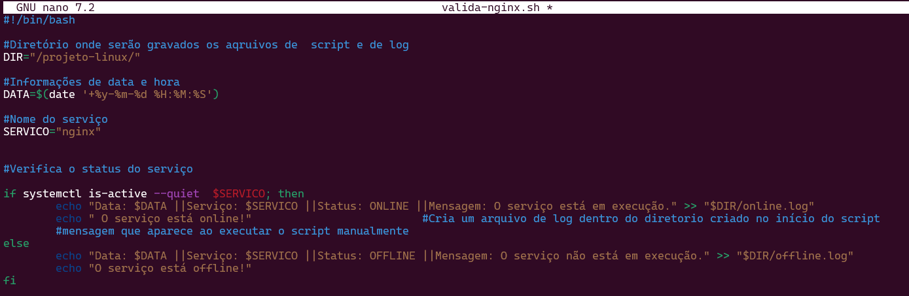

# Trilha de DevSecOps - Atividade Prática 1 
### Documentação do primeiro projeto proposto para a trilha DevSecOps do Programa de Bolsas CompassUOL, turma de Novembro de 2024.

---


## Objetivo
Criar um ambiente Linux no Windows, criar e executar um script que verifique se o servidor Nginx está online e rodando, e registrar seus status em  arquivos de log.

## Requisitos técnicos
- Windows 11
- Ubuntu 20.4 ou superior
- WSL

## Requisitos da atividade
- Utilizar o WSL do Windows e criar um subsistema do Ubuntu 20.04 ou superior. 
- Subir um servidor Nginx que esteja online e rodando.
- Criar um script que valide se o serviço está online e enviar o resultado da validação para  um diretório definido pelo usuário.
- O script deve conter: data e hora, nome do serviço, status e mensagem personalizada de online ou offline.
- O script deve gerar dois arquivos de saída: um para o serviço online e um para o serviço offline.
- Preparar a execução automatizada do script a cada 5 minutos.

## Índice

<ol>
    <li><a href="#criando-ambiente">Criando um ambiente Linux no Windows</a></li>
    <li><a href="#instalando-nginx">Instalando o servidor Nginx</a></li>
    <li><a href="#criando-script">Criando o script de validação</a></li>
    <li><a href="#automatizando-script"> Automatizando o script</a></li>
    <li><a href="#verificando-log">Verificando os arquivos de log</a></li>
</ol>


---

<h2 id="criando-ambiente">1. Criando um ambiente Linux no Windows</h2>
Para criar o ambiente Linux no Windows, primeiro é necessário ativar o WSL(Subsistema Windows para Linux). Abra o terminal PowerShell ou Prompt de Comando do Windows e digite o comando exibido na imagem abaixo. É importante que isso seja feito no modo administrador. 


Após a instalação ser concluída, reinicie o seu computador, conforme instruções da documentação oficial. Uma vez instalado, siga as instruções no terminal, como criar um login e senha para o usuário no Ubuntu.


O subsistema está pronto para ser utilizado. 

<h2 id="instalando-nginx">2. Instalando o servidor Nginx</h2>
Antes de instalar o servidor Nginx, é importante atualizar os pacotes do sistemas através do comando abaixo:
```bash
sudo apt update
```
Após a atualização, seguimos com os comandos para instalar o Nginx: 
```bash
sudo apt install nginx
```
Completada a instalação do servidor, podemos verificar o seu funcionamento através do comando:
```bash
service nginx status
```
Veremos a seguinte mensagem, caso o servidor esteja conectado e funcionando:


Além do comando utilizado no terminal, é possível verificar se o Nginx está conectado digitando ***localhost*** em seu navegador. Caso esteja funcionando, teremos a seguinte mensagem na tela:


<h2 id="criando-script">3. Criando o script de validação</h2>

Antes de escrever o script, vamos criar um diretório para guardar o arquivo do script e de logs. Utilizando o seguinte comando:

```bash
mdkir projeto-linux
```
Dentro do novo diretório, criamos o arquivo de script:
```bash
nano valida-nginx.sh
```
Conforme os requisitos do projeto, o script deve conter data e hora, nome do serviço, status do serviço e mensagem personalizada indicando se ele está online ou offline.



Para que o script possa ser executado corretamente, é necessário alterarmos as permissões do arquivo, adicionando a permissão "executar":

```bash
chmod +x valida-nginx.sh
```

<h2 id="automatizando-script">4. Automatizando o script</h2>

Para automatizar a verificação de status do Nginx, vamos utilizar o programa crontab, que permite o agendamento de tarefas e sua execução na data e hora agendada. 
Vamos editar o arquivo crontab e inserir as informações para automatizar o script *valida-nginx.sh*:

```bash
crontab -e
```


A barra (\*/5) é usada no crontab para indicar um intervalo, no caso do script criado, vamos executá-lo a cada cinco minutos, começando do zero. Por exemplo, \*/5 nos minutos executa nos tempos: 0, 5, 10, 15, 20, ..., 55.Ela pode ser combinada com outros valores. Exemplo: 1-30/5 = "Do minuto 1 ao 30, a cada 5 minutos" (1, 6, 11, 16, 21, 26).


Após editado, o script começará a ser executado automaticamente e gravará os registros de status nos arquivos de log criados.

<h2 id="verificando-log">5. Verificando os arquivos de log</h2>

Para verificar se a atividade do serviço está funcionando,  digitamos o seguinte comando:

- Se estiver no diretório do arquivo 
```bash
cat online.log
```
- Se estiver fora do diretório do arquivo
```bash
cat /projeto-linux/online.log
```
Em ambos os casos, a saída deve ser essa:


Para verificar o log de offline, o comando é o mesmo, apenas mudamos o nome do arquivo.

- Se estiver no diretório do arquivo 
```bash
cat offline.log
```
- Se estiver fora do diretório do arquivo
```bash
cat /projeto-linux/offline.log
```


A partir dessa documentação, é possível criar scripts de verificação de servidores, alterando o servidor e o intervalo de tempo desejado. 

